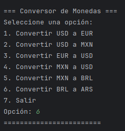
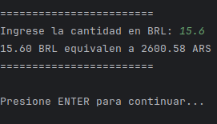

# Conversor de Moneda
Este proyecto tiene la finalidad de presentar mi solucion para el reto de "Conversor de Moneda" de ALURA.

Para ello use lo siguiente:
- JAVA21
- Gson: Para poder usar servicios de API
- API: Para solicitar los datoas en tiempo real de los valores actuales de las monedas
      [API_MONEDA](https://www.exchangerate-api.com/)
  
### USO
Simplemente debemos de correr el 'Main.Java', para poder usar el programa.
Escogemos la opcion para la conversion y uso del programa

---

Pruebas en terminal

